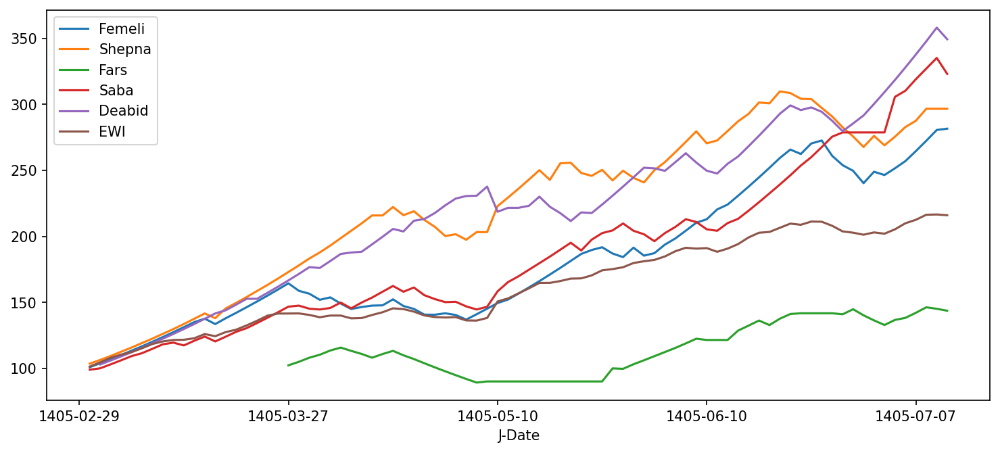

# tse-stocks-post-reopening-risk-return-analysis
# Post-Reopening Performance of Leading Tehran Stock Exchange Stocks

A risk–return analysis of five leading stocks, one from each of five major industries, after the Tehran Stock Exchange reopened following the war. Each stock is compared with the equal-weighted index (EWI).

**Period:** 1405-02-29 to 1405-07-12 (Solar Hijri calendar)
**Tools:** Python, pandas, NumPy, Matplotlib, finpy_tse, Jupyter Notebook

## Stocks

| Ticker | English name |
|---|---|
| فملی | Fameli |
| شپنا | Shepna |
| فارس | Fars |
| صبا | Saba |
| دعبید | Deabid |

## What the project does

1. Downloads adjusted daily prices for the five stocks and the equal-weighted index using `finpy_tse`
2. Calculates daily returns, average daily return and standard deviation (volatility)
3. Calculates total return and excess return versus the index
4. Calculates maximum drawdown for each asset
5. Plots the growth of 100 units invested in each asset
6. Summarizes all metrics in one table

## Results

| | Total Return % | Max Drawdown % |
|---|---|---|
| Fameli | 181.52 | -16.69 |
| Shepna | 196.58 | -13.61 |
| Fars | 43.66 | -22.89 |
| Saba | 222.98 | -10.98 |
| Deabid | 249.23 | -10.98 |
| EWI | 115.96 | -6.38 |

### Key findings

- Four of the five stocks beat the equal-weighted index. Deabid and Saba delivered the highest returns with the mildest drawdowns among the stocks.
- Fars returned the least and had the deepest drawdown. It was closed for part of the period, so its return is measured from the first day it traded again.
- The index had the smallest drawdown, which shows the diversification effect.

### Limitations

- Short period and a small sample of only five stocks
- Stocks were chosen as industry leaders, which may introduce selection bias
- Returns are nominal (in rials) and not adjusted for inflation

## Files

- `project_1.ipynb`: the full analysis (code, charts and conclusions)
- `Data.csv`: the price data used in the analysis
- `cumulative.png`: cumulative growth chart

## How to run

1. Install the libraries: `pip install numpy pandas matplotlib finpy_tse`
2. Open `project_1.ipynb` in Jupyter Notebook
3. Run all cells (`Kernel` → `Restart & Run All`)

Note: the data is downloaded live from the exchange through `finpy_tse`, so an internet connection is needed. The saved `Data.csv` contains the data used in this analysis.
